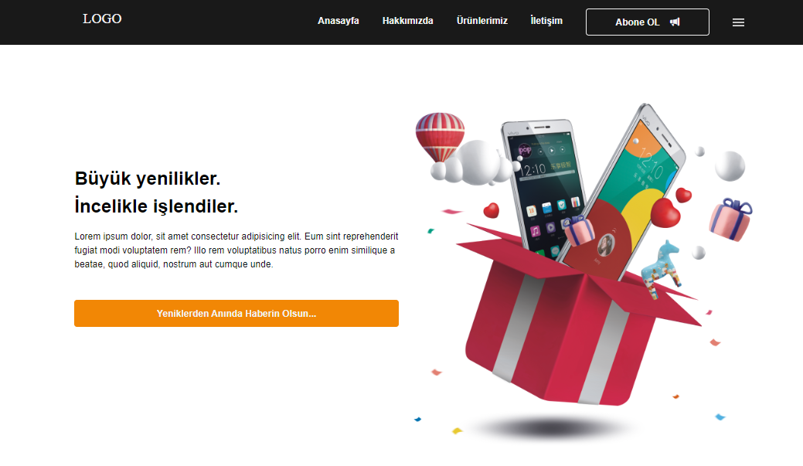

# basicProject-header-hero

<<<<<<< HEAD
Dear,

In this project, I designed and developed header and hero fields using my frontend skills. I created the user interface using HTML, CSS and JavaScript and paid attention to responsive design principles.

 
 

=======
In this project, I designed and developed header and hero fields using my frontend skills. I created the user interface using
HTML, CSS and JavaScript and paid attention to responsive design principles.
>>>>>>> c7b4b4a1bcffb3c91858a1110aa12752c11b484c
